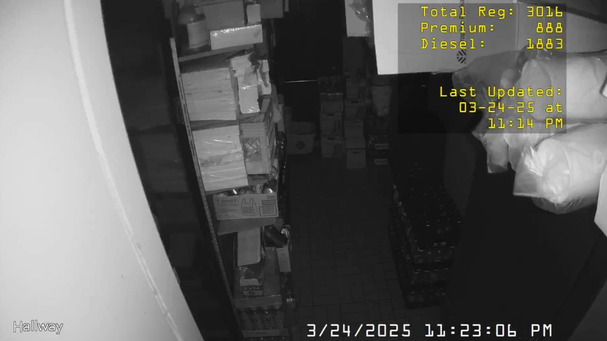

# Veeder Root Fuel Management System Poller

A Python script that polls the Veeder Root fuel management system for tank reserves, creates a text file with the data, and updates Blue Iris overlay variables.

### Example Deployment:



## Overview

This script connects to a Veeder Root fuel management system via a serial connection, retrieves current fuel tank levels, formats the data, and writes it to a text file. The data can then be used with Blue Iris camera system overlays to display fuel levels on camera feeds.

## Features

- Polls Veeder Root system for tank level data
- Retrieves and processes data for multiple tanks:
  - Regular West
  - Regular East
  - Premium
  - Diesel
- Calculates total regular fuel
- Updates data every 10 minutes
- Creates formatted text output compatible with Blue Iris overlay variables

## Requirements

- Python 3.x
- `pyserial` library
- Veeder Root fuel management system with serial connection
- Blue Iris video surveillance software (for displaying the data)

## Installation

1. Clone the repository:
   ```
   git clone https://github.com/Akeid/veeder-root-poller.git
   ```

2. Install the required dependencies:
   ```
   pip install pyserial
   ```

3. Configure the script by modifying the `PORT_COM` variable to match your serial port connection (default is "COM6").

## Usage

Run the script:
```
python veeder_root_poller.py
```

The script will:
1. Connect to the Veeder Root system via serial port
2. Poll for tank data every 10 minutes
3. Parse the response to extract fuel levels
4. Write formatted data to a text file named "veederroot.txt" in the same directory

## Blue Iris Integration

This script is designed to work with Blue Iris overlay variables. For instructions on setting up the Blue Iris integration, see [Blue-Iris-POS-Transaction-Overlay](https://github.com/Akeid/Blue-Iris-POS-Transaction-Overlay).

The text file output format is:
```
Total Reg: xxxx
Premium:   xxxx
Diesel:    xxxx

Last Updated: 
MM-DD-YY at 
HH:MM AM/PM
```

### Example Overlay

Below is an example of how the data appears when displayed as an overlay in Blue Iris:


## Customization

You can modify the script to:
- Change the polling interval (default is 600 seconds / 10 minutes)
- Add additional tanks
- Change the format of the output text
- Adjust the position of data in the byte buffer if your Veeder Root system returns data in a different format

## Troubleshooting

- Ensure the correct COM port is specified
- Verify the baud rate matches your Veeder Root system (default is 9600)
- Check permissions if you encounter file writing errors

## License

This project is licensed under the Creative Commons Attribution-NonCommercial 4.0 International License (CC BY-NC 4.0).

This means:
- You are free to share and adapt this code
- You must give appropriate credit to the original author (Akeid)
- You may not use the material for commercial purposes
- No additional restrictions — You may not apply legal terms or technological measures that legally restrict others from doing anything the license permits

For more information, see the [full license text](https://creativecommons.org/licenses/by-nc/4.0/legalcode).

## Author

Created by [Akeid](https://github.com/Akeid)
